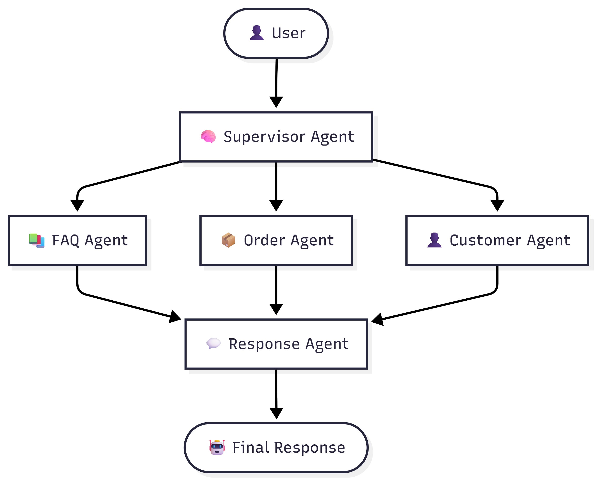

# 🤖 SupportFlow AI

**SupportFlow AI** is a **Multi-Agent Customer Support System** built using **LangGraph**. It intelligently routes customer queries to specialized AI agents, leveraging **RAG (ChromaDB)**, **SQLite**, and **conversational memory** to deliver accurate and context-aware responses.

---

## 🚀 Features

- 🧠 **Supervisor Agent** for intelligent query routing
- 📚 **FAQ Agent** powered by RAG using ChromaDB
- 📦 **Order Agent** for order status and tracking
- 👤 **Customer Agent** for customer information retrieval
- 💬 **Response Agent** to generate contextual responses
- 🧠 Conversational memory using LangGraph MemorySaver
- 📊 Real-time workflow visualization
- 🌐 Interactive Streamlit interface

---

## 🏗️ System Architecture



---

## 🛠️ Tech Stack

| Category | Technologies |
|----------|--------------|
| Language | Python |
| AI Framework | LangGraph, LangChain |
| LLM | Groq |
| Embeddings | Hugging Face Embeddings |
| Vector Database | ChromaDB |
| Database | SQLite |
| Frontend | Streamlit |
| Retrieval | RAG (Retrieval-Augmented Generation) |

---

## 📂 Project Structure

```
SupportFlow-AI/
│
├── app/
│   ├── agents/
│   │   ├── supervisor.py
│   │   ├── router.py
│   │   ├── faq_agent.py
│   │   ├── order_agent.py
│   │   ├── customer_agent.py
│   │   └── responder.py
│   │
│   ├── rag/
│   ├── database/
│   ├── graph.py
│   ├── llm.py
│   ├── prompts.py
│   └── state.py
│
├── assets/
│   └── architecture-diagram.png
│
├── data/
│   ├── faq.json
│   ├── customers.json
│   └── orders.json
│
├── streamlit_app.py
├── main.py
├── requirements.txt
└── README.md
```

---

## ⚙️ How It Works

1. User submits a customer support query.
2. The **Supervisor Agent** analyzes the query.
3. The query is routed to the appropriate specialized agent:
   - FAQ Agent
   - Order Agent
   - Customer Agent
4. The selected agent retrieves relevant information from ChromaDB or SQLite.
5. The **Response Agent** generates a context-aware answer.
6. The workflow is displayed in the Streamlit interface.

---

## 🤖 Agents

### 🧠 Supervisor Agent
Determines the user's intent and routes the query to the appropriate agent.

### 📚 FAQ Agent
Uses Retrieval-Augmented Generation (RAG) with ChromaDB to answer frequently asked questions.

### 📦 Order Agent
Retrieves order information such as status, amount, and tracking details from SQLite.

### 👤 Customer Agent
Fetches customer information including plans and account details from SQLite.

### 💬 Response Agent
Combines retrieved context and generates the final response using the LLM.

---

## 💡 Example Queries

```
How long does a refund take?

Where is order 5002?

Customer ID is 1001.

What is my current plan?

What is its status?
```

---

## 📷 Live Demo

https://supportflow-ai-agent.streamlit.app/

### Home Screen

> assets/SupportFlowAI-home.png

### Chat Interface

> assets/SupportFlowAI-ChatUI.png

---

## 🚀 Installation

### Clone the repository

```bash
git clone https://github.com/<your-username>/SupportFlow-AI.git

cd SupportFlow-AI
```

### Create a virtual environment

```bash
python -m venv .venv
```

### Activate the environment

**Windows**

```bash
.venv\Scripts\activate
```

**Linux/macOS**

```bash
source .venv/bin/activate
```

### Install dependencies

```bash
pip install -r requirements.txt
```

### Configure environment variables

Create a `.env` file.

```env
GROQ_API_KEY=your_api_key
```

### Build the knowledge base

```bash
python -m app.rag.ingest
```

### Run the application

```bash
streamlit run streamlit_app.py
```

---

## 🎯 Future Improvements

- Multi-agent parallel execution
- Ticket creation and escalation
- Authentication and role-based access
- REST API integration
- Docker deployment
- Human-in-the-loop support
- Analytics dashboard

---

## 👩‍💻 Author

**Sakshi Dethe**

- GitHub: https://github.com/SakshiDethe03
- LinkedIn: https://linkedin.com/in/sakshi-dethe-409901294

---

## ⭐ If you found this project useful, consider giving it a star!
